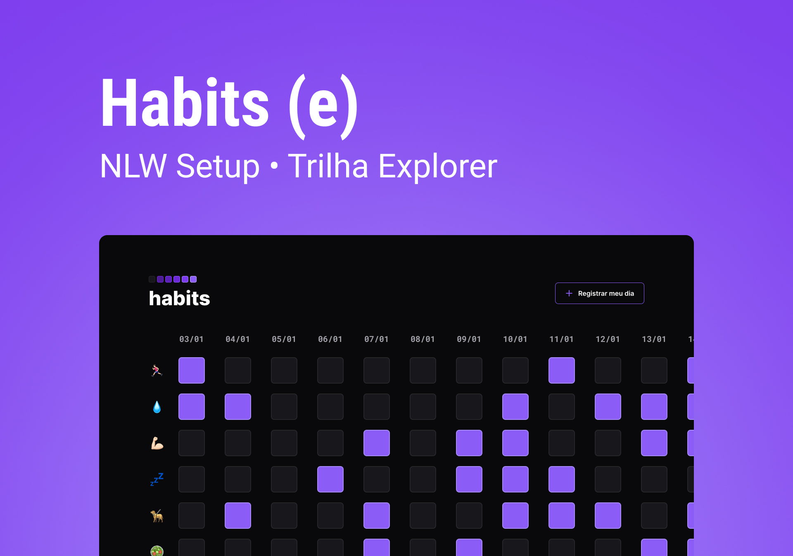

<h1 align="center"> #NLW Habits </h1>

NLW is a private event by RocketSeat to take WEB developer to the next level.  

  <a href="#-tecnologias">Tech</a>&nbsp;&nbsp;&nbsp;|&nbsp;&nbsp;&nbsp;
  <a href="#-projeto">Project</a>&nbsp;&nbsp;&nbsp;|&nbsp;&nbsp;&nbsp;
  <a href="#-layout">Layout</a>&nbsp;&nbsp;&nbsp;|&nbsp;&nbsp;&nbsp;
  <a href="#memo-licença">License</a>

  

 

  

## 🚀 Tech

This project was developed with the following technologies:

- HTML
- CSS
- JavaScript
- Git and Github
- Figma

## 💻 Project

Habits is an app that helps you to track your daily habits. Check if you drink enough water that day or remember if you were able to run yesterday morning.

- [Acess Habits App online](https://brunaporato.github.io/nlw-setup)

## 🔖 Layout

Check the project layout on [Figma](https://www.figma.com/file/GG2BAPAm032g5RLUQEhF6U/Habits-(e)-(Community)?node-id=6-910&t=WM0lKVHcVcFwO9TN-0).

## :memo: License

This project is under MIT license.

---

Thank you for checking ♥ :wave: